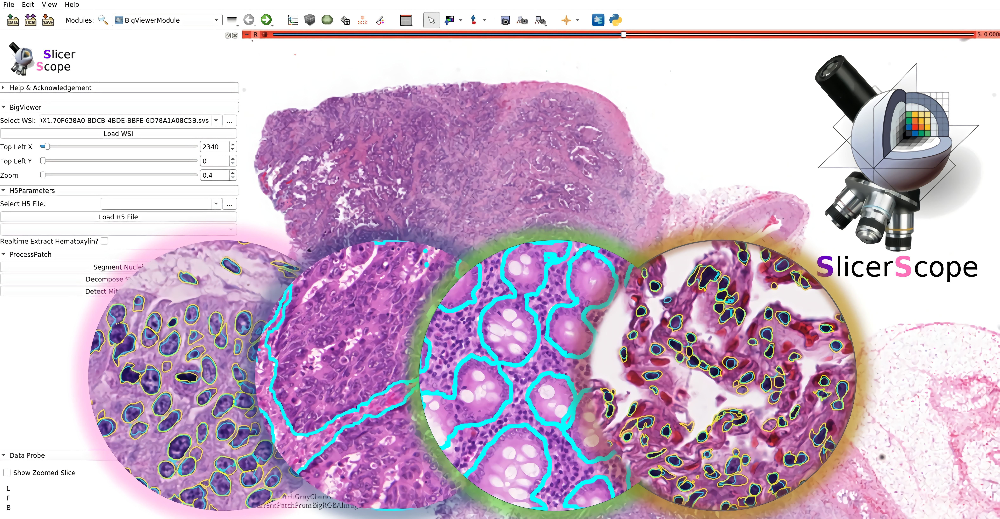
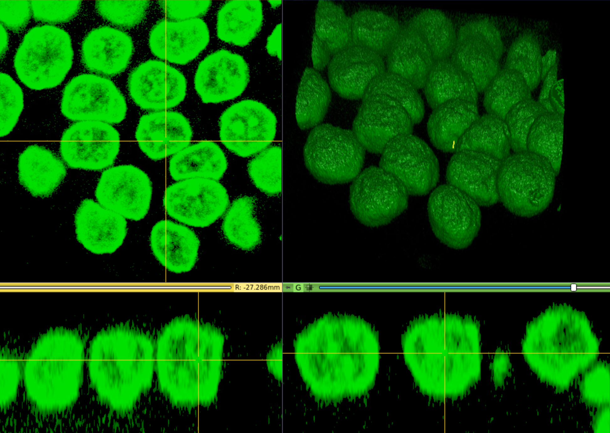

# About SlicerScope
SlicerScope is an open platform for whole slide histopathology image computing based on the highly successful 3D Slicer. SlicerScope has three specific analytical modules for staining decomposition, nucleus segmentation, and gland segmentation of 2D/3D histopathology images. It's open-source, extendable, facilitating the algorithmic, clinical, and transnational researches.We open source the code of SlicerScope on [GitHub](https://github.com/SlicerScope/SlicerScope) for compilation and further development, and at the same time provide a compiled version.

***
# What can SlicerScope do?

| Staining decomposition  |  Nucleus segmentation  |  Gland segmentation | 3D Pathology |
| :-: |  :-:  |  :-: | :-: |
|   |    |    |  |

***
# Contact us
If you encounter any problem, please email <a href="mailto:gaoyicn@outlook.com">gaoyicn@outlook.com</a>