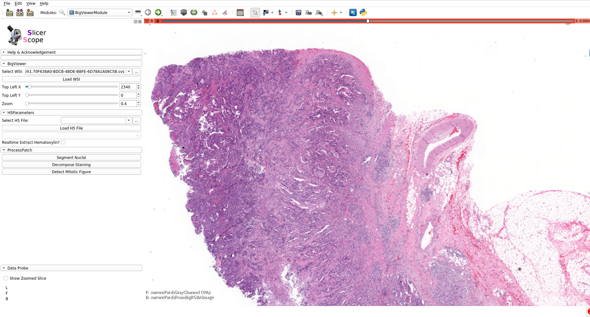
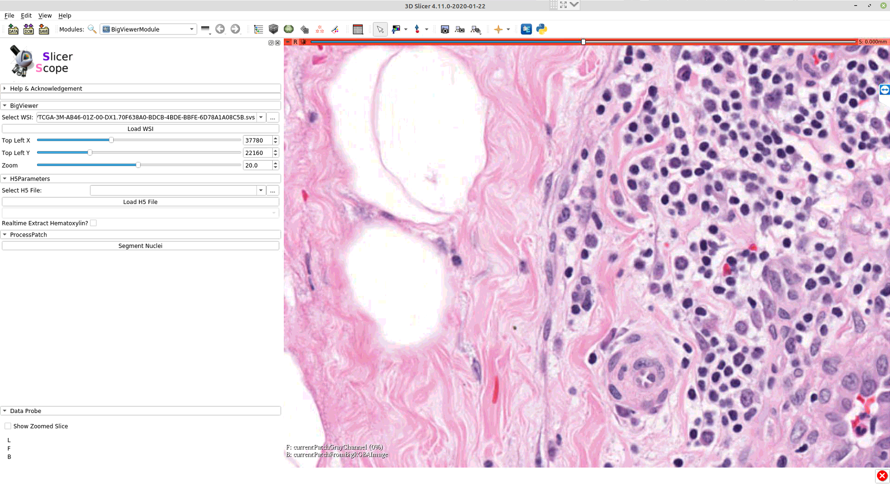
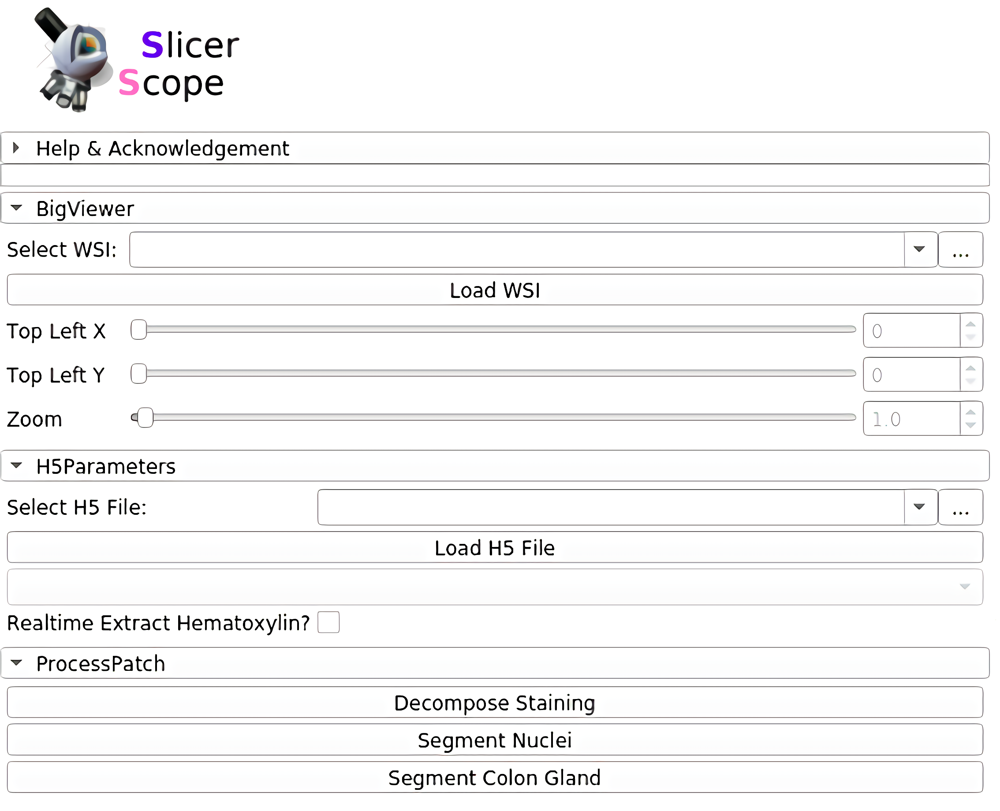
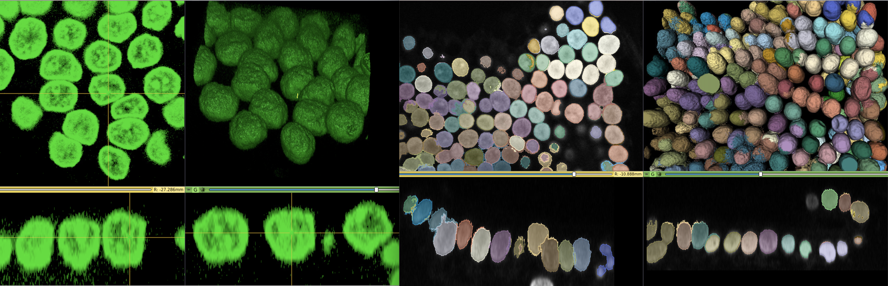

# Documents

## [3D Slicer](https://www.slicer.org/) and SlicerScope
3D Slicer is an open source software platform for medical image informatics, image processing, and three-dimensional visualization. Built over two decades through support from the National Institutes of Health and a worldwide developer community, Slicer brings free, powerful cross-platform processing tools to physicians, researchers, and the general public.

3D Slicer has a large user base and strong community support. It has a mature development and extension processes. Although most of users are in the radiological image related fields,such a large community would certainly be helpful to the computational pathology community. Slicer was originally designed for 3D and higherdimensional radiology images. Therefore it has more native support for 3D visualization and computing than other software designed from 2D image. Being a transnational research tool, rather than a commercially oriented software,such an infrastructure would be very beneficial for advancing multiplexing microscopy, 3D pathology, and even 3D+time dynamic microscopy. Based on these perspective needs, the3D Slicer fits very well as the infrastructure for a histopathology image computing platform that can accommodate both current needs and future applications.

However, all its successful medical applications are in the radiology image fields where the entire image can be directly loaded into the memory. With the present work of SlicerScope, we extend the Slicer into this new field of computational pathology, and we believe that both the computational pathology and Slicer community would benefit from such an synergistic software.

## SlicerScope GUI

<!--  -->

Following pathologists’ convention, mouse wheels as wellas the slide bar (in the module panel)can both be used for changing magnification  power in a continuous fashion.Internally, the images are formed by interpolation if theviewing magnification does not match with the resolutions stored in the hierarchical format of image pyramid.

<!--  -->

The whole panel can be divided into three sections. In the first section, the user sets the path to the WSI, as well as the location and magnification. The adjustment of these parameters are connected with mouse motions: left/right mouse drag for panning and the mouse wheel for changing magnification.For precise adjustment, user can use the numerical input.The second section loads the accompanying hdf5 file of the WSI, which stores the already computed information for this slide.The third section includes a list of computation modules. Clicking each button would invoke the computation on that current viewing region. Further functions could also be addedand their button may appear in this same section.

<!--  -->

***
## Staining decomposition
SlicerScope implement the vanilla version of color decomposition for its robustness, versatility, and computational efficiency.staining decomposition module in SlicerScope adopted from the Java implementation in ImageJ, the module implemented different decomposition configurations.

<!--  -->

***
## Nucleus segmentation
Nucleus segmentation module in SlicerScope, we propose a hierarchical approach which starts from the lower resolution level and adaptively adjusts the parameters while progressing into finer and finer resolution. we use mean-shift algorithm  decompose clumping regions into the individual nucleus.

The average Dice coefficients for brain images is 0.71 with standard deviation of 0.048.Contour colors: yellow(GT), cyan (algorithm).

<!--  -->

The average Dice coefficients for all lung images  is 0.70 with standard deviation of 0.045.Contour colors: yellow(GT), cyan (algorithm).

<!--  -->

***
## Gland segmentation
SlicerScope propose a patch-based U-net algorithm to extract the gland region. We used the training and testing images from the GLAS colon gland segmentation challenge. The average Dice coefficient is 0.910 and the standard deviation is 0.043. Contour colors: yellow(GT), cyan (algorithm).

<!--  -->

***
## For 3D pathology
One significant benefit of using 3D Slicer as the back-bone  structure for computational pathology lies in the fact that 3D Slicer was originally designed for three-and-higher dimensional image computing. This feature naturally fits the 3D pathology scenario. In situations such as confocal microscopic imaging of thecells, one may want to extract the 3D extent of each cells.SlicerScope can benefit from the richcontent of the existing modules from 3D Slicer.

## How to build SlicerScope from source code?
- for [windows](https://slicer.readthedocs.io/en/latest/developer_guide/build_instructions/windows.html)
- for [Linux](https://slicer.readthedocs.io/en/latest/developer_guide/build_instructions/linux.html)
- for [mac OS](https://slicer.readthedocs.io/en/latest/developer_guide/build_instructions/macos.html)

***
## How to extand SlicerScope?
Being one of the leading open-source medical image computing platforms, 3D Slicer not only ships abundant algorithms with it, it also has a well-established mechanismthat the user can extend  Slicer with their own algorithms. To serve such a purpose, Slicer  provides three channels:the command-line interface, the python script interface, andthe c++ loadable interface. One need to consider the characteristics of the whole slide images in order to pick thetype of interface.

### Command Line Interface (CLI)
CLIs are standalone executables with a limited input/output arguments complexity (simple argument types, no user interactions...). They are typically implemented in C++ (using ITK). SlicerScope allow running (almost) any Python script as a CLI module by providing an interface description .xml file.

### Loadable Modules(C++)
Loadable modules are C++ plugins that are built against Slicer. They define custom GUIs for their specific behavior as they have full control over the application.

### Scripted Modules(Python)
Full access to the API: VTK, Qt, MRML and Slicer,SimpleITK are fully wrapped.

## More Information
- https://www.slicer.org/wiki/Documentation/Nightly/Developers/FAQ/Extensions#How_to_build_an_extension_.3F
- https://www.slicer.org/wiki/Documentation/Nightly/Developers/Modules
- https://www.slicer.org/wiki/Documentation/Nightly/Developers/ExtensionWizard
- https://www.slicer.org/wiki/Documentation/Nightly/Developers/Build_Module
- https://www.na-mic.org/wiki/2013_Project_Week_Breakout_Session:Slicer4Python
- https://www.slicer.org/wiki/Documentation/Nightly/Training#Developing_and_contributing_extensions_for_3D_Slicer
